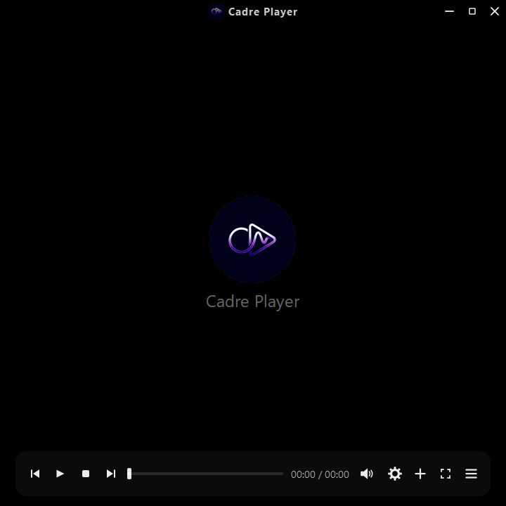
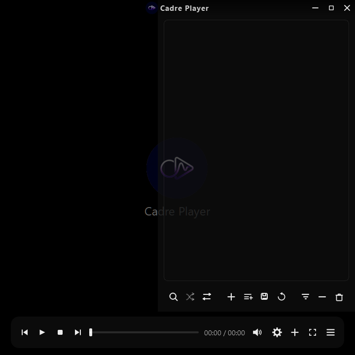
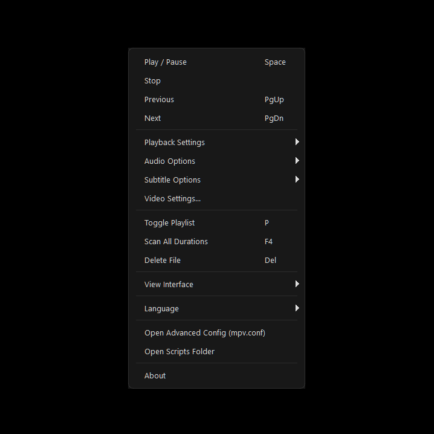
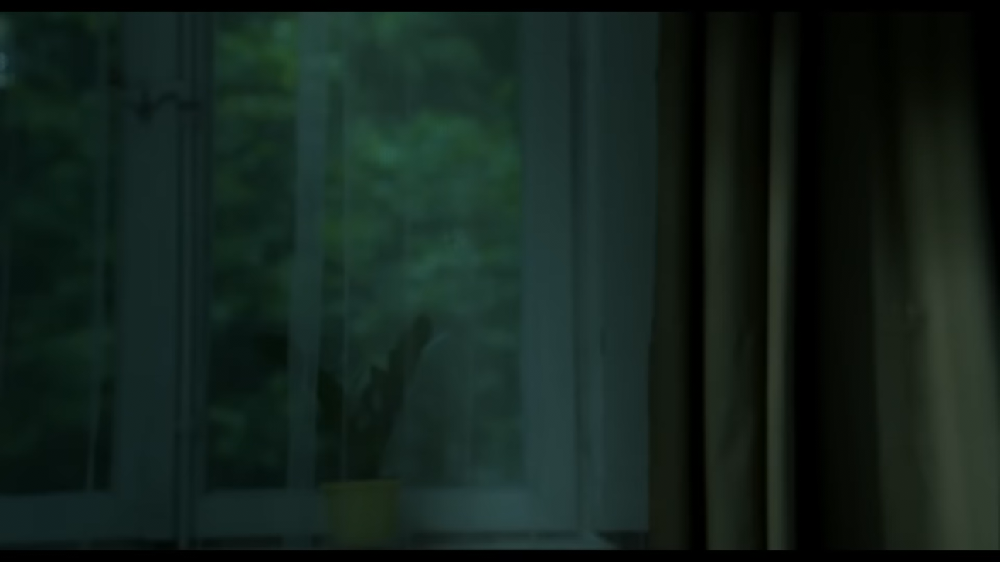

[](https://buymeacoffee.com/lunedor)

# Cadre Player


Cadre Player is a frameless desktop media player built with Python, PySide6 (Qt), and libmpv.

It is focused on:
- fast playlist workflows
- clean playback controls
- local files + URL-based media (WebDAV, m3u/m3u8, YouTube links/playlists)

## Screenshots

  
  
*Compact controls with frameless design*

  
*Quick-access video/subtitle tweaks*

  
*All overlays active: titlebar + controls + playlist on video*

  
*Minimal mode: video-focused, auto-hiding UI*

## Features

- Frameless UI with custom title overlay and transport controls
- Move window by click+hold on the video area (not only the title bar)
- Playlist panel with drag-drop reorder, search, sort, and multi-select actions
- Import from file, folder, URL, remote m3u/m3u8, and WebDAV folder
- YouTube URL/playlist extraction through `yt-dlp`
- Playback speed controls, shuffle, repeat modes
- Visual chapter markers on the seekbar (from libmpv chapter metadata)
- Optional seekbar thumbnail preview while hovering (`Video Settings -> Geometry -> Seek Thumbnail Preview`)
- Subtitle settings, video tuning, and 10-band equalizer
- OpenSubtitles.com integration (search + download + apply in-app, `Shift+S`)
- Downloaded subtitles are stored per media in `%APPDATA%\CadrePlayer\subtitles\` and auto-loaded on replay
- Subtitle delay is saved per file (instead of one global delay)
- Video geometry tools: rotation + mirror horizontal/vertical (X/Y shortcuts)
- On-demand technical stats overlay via mpv `stats.lua` (`Shift+I`)
- Power-user mpv integration: app-managed `mpv.conf` + `scripts/` (Lua/JS auto-loaded)
- Session playlist snapshot with one-click restore from playlist controls
- Auto-restore last saved session playlist on startup when launching without explicit media arguments
- Stream import feedback with summary toast (`Imported X, failed Y`) and detailed log entries
- Resume position per item
- Playlist save/load
- Runtime diagnostics logging (`logs.txt`)

## Requirements

- Python 3.8+
- `libmpv` runtime (`mpv-1.dll` / `libmpv`)
- Dependencies in `requirements.txt`:
  - `PySide6`
  - `python-mpv`
  - `Send2Trash`
  - `yt-dlp`
- For reliable modern YouTube extraction, install `Deno` (2.0+ recommended) and ensure `deno` is available on PATH.

Windows is the primary tested platform.

## Installation

```bash
git clone https://github.com/Lunedor/cadre-player.git
cd cadre-player
pip install -r requirements.txt
```

## mpv Runtime Setup

Cadre Player needs `libmpv` available at runtime.

- On Windows, place `mpv-1.dll` in the project root (same folder as `main.py`), or make sure it is discoverable via system PATH.
- If missing, get binaries from [mpv.io](https://mpv.io/installation/).

## Run

```bash
python main.pyw
```

or

```bash
python main.py
```

## Keyboard Shortcuts

| Key | Action |
| --- | --- |
| Space | Play / Pause |
| Left / Right | Seek backward / forward |
| Up / Down | Volume up / down |
| PageUp | Previous item |
| PageDown | Next item |
| Enter | Toggle fullscreen or play selected item when playlist is focused |
| F | Toggle fullscreen |
| Esc | Exit fullscreen or hide unpinned playlist |
| Delete | Remove selected playlist item(s) |
| Shift+Delete | Move selected local file(s) to recycle bin / trash |
| Ctrl+O | Open file(s) |
| Ctrl+Shift+O | Open folder |
| Ctrl+L | Open URL dialog |
| P | Toggle playlist panel |
| M | Mute / Unmute |
| S | Save screenshot |
| V | Open video settings |
| F4 | Toggle full-duration scan |
| . | Next frame |
| , | Previous frame |
| [ | Decrease playback speed (step) |
| ] | Increase playback speed (step) |
| + | Window zoom in |
| - | Window zoom out |
| 0 | Reset window zoom and reset pan |
| 4 | Pan left only when video is zoomed |
| 6 | Pan right only when video is zoomed |
| 8 | Pan up only when video is zoomed |
| 2 | Pan down only when video is zoomed |
| R | Rotate video +90° |
| Ctrl+R | Reset rotation |
| X | Toggle mirror horizontal |
| Y | Toggle mirror vertical |
| B | Increase brightness |
| Shift+B | Decrease brightness |
| G | Subtitle delay -0.1s |
| H | Subtitle delay +0.1s |
| J | Subtitle size -1 |
| K | Subtitle size +1 |
| U | Subtitle position -1 |
| I | Subtitle position +1 |
| Shift+S | Open OpenSubtitles dialog |
| Shift+I | Toggle mpv technical stats overlay (`stats/display-stats-toggle`) |

## mpv Power-User Config

Cadre Player creates and uses an app-managed mpv power-user layout:

- `mpv.conf` for advanced raw libmpv options
- `scripts/` folder for native mpv scripts (`.lua`, `.js`)
- Main menu actions:
  - `Open Advanced Config (mpv.conf)`
  - `Open Scripts Folder`

Precedence and sync behavior (startup):
- For shared video keys, `mpv.conf` is the source of truth.
- Detected values are synced into `settings.ini` so GUI controls show applied values.
- Shared keys currently synced: `vo`, `gpu-api`, `hwdec`, `brightness`, `contrast`, `saturation`, `gamma`, `video-zoom`, `video-rotate`.

Paths:
- Development mode: project root
- Packaged/frozen mode on Windows: `%APPDATA%\CadrePlayer\`

## Logs and Data Files

In development mode (running from source), files are kept in the project root:
- `logs.txt`
- `settings.ini`
- `mpv.conf`
- `scripts/`

In packaged/frozen mode on Windows, files are stored in:
- `%APPDATA%\CadrePlayer\`
  - includes `subtitles/` (downloaded OpenSubtitles files) and `opensubtitles_tokens.json` (cached OpenSubtitles JWT tokens)

## Troubleshooting

- YouTube links fail to import:
  - update `yt-dlp`
  - ensure `deno` is installed and available on PATH
  - ensure internet access works
  - check `logs.txt` for lines containing `YouTube extract` and `URL resolve`
- URL dialog closes without importing:
  - press the `Open` button explicitly (Enter now triggers Open in the URL field)
- No playback:
  - verify `mpv-1.dll` / `libmpv` is available

## Known Issues

- Cannot seek or start from a certain time with high-quality and long YouTube videos. This is related to yt-dlp, mpv, and YouTube stream logic, which I have not yet figured out how to fix. You can try different codec options from the Video Quality menu; H.264 and AV1 produce better results for this issue.

## Project Structure

- `main.py`, `main.pyw`: app entry points
- `player_window.py`: player UI + playback flow + import pipeline
- `playlist.py`: duration scanning worker
- `logic.py`: repeat/shuffle behavior
- `ui/`: widgets, dialogs, icons, styles, menus
- `settings.py`: settings helpers
- `app_logging.py`: logging + exception hooks
- `locales/`: translation files (English, German, French, Spanish, Italian, Turkish, Portuguese, Russian, Ukranian, Japanese, Chinese and Arabic)

## License

MIT License. See [LICENSE](LICENSE).
